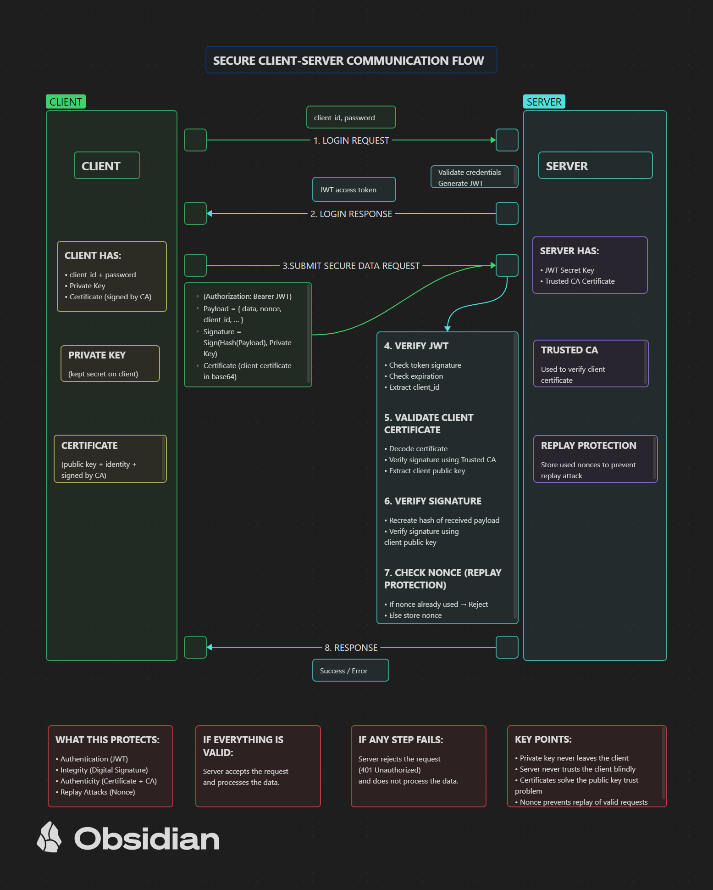

# Secure Client-Server System

A secure client-server system built with FastAPI, JWT authentication, and RSA digital signatures to protect against unauthorized access, impersonation, and payload tampering.

---

## Project Goal

This project demonstrates how theoretical concepts from System Security can be applied in a real implementation.

The system protects against:

* Unauthorized access
* User impersonation
* JWT misuse
* Payload tampering
* Fake requests
* Replay attack 

It combines three major security layers:

* Authentication
* Authorization
* Integrity verification

---

## Security Features

### Authentication

Users authenticate using username and password:

```python
client_id = "m"
password = "123"
```

This represents:

**Something You Know** (password-based authentication)

---

### Authorization

After successful login, the server generates a JWT token.

The token includes:

* subject (`sub`)
* issued time (`iat`)
* expiration time (`exp`)

Only users with valid JWT tokens can access protected endpoints.

---

### Integrity Protection

The client signs the payload using:

* ECDSA (Elliptic Curve Digital Signature Algorithm)
* SHA-256 hashing

The server verifies the signature using the client’s public key.

If the payload is modified, verification fails immediately.

---

## System Architecture



---

## Technologies Used

* Python
* FastAPI
* Uvicorn
* PyJWT
* Cryptography
* ECDSA
* SHA-256
* HTTP Bearer Authentication

---

## How It Works

### Step 1 — Login

The client sends credentials to:

```text
POST /login
```

Example:

```json
{
  "client_id": "m",
  "password": "123"
}
```

If valid:

→ Server returns JWT token

---

### Step 2 — Payload Signing

The client prepares payload:

```json
{
  "exam": "system_security",
  "score": 28
}
```

Then signs it using the private key.

---

### Step 3 — Secure Submission

The client sends:

* JWT token
* payload
* digital signature

to:

```text
POST /data/submit
```

---

### Step 4 — Server Verification

The server verifies:

1. JWT token validity
2. token ownership
3. payload signature

If all checks pass:

```json
{
  "status": "accepted"
}
```

---

## Example Security Test

Original payload:

```json
{
  "score": 28
}
```

Tampered payload:

```json
{
  "score": 29
}
```

Result:

```text
401 Invalid payload signature
```

This proves payload integrity.

---

## Security Principles Applied

* Least Privilege
* Complete Mediation
* Reference Monitor
* Defense in Depth
* Public Key Cryptography
* Digital Signatures

---

## Future Improvements

Possible production-level improvements:

* HTTPS / TLS
* Password hashing (bcrypt)
* Refresh tokens
* X.509 certificates
* Certificate Authority validation
* Role-Based Access Control (RBAC)
* Audit logging
* Rate limiting
* Anti-replay nonce protection

---

## Final Note

This project shows that security is not a single feature.

It is a system of multiple coordinated protections working together:

Authentication + Authorization + Cryptography + Integrity Verification
=======
A secure client-server architecture built with **FastAPI** implementing authentication, digital signatures, certificate validation, and replay attack protection.

## Features

- JWT authentication
- RSA digital signatures
- X.509 certificate validation
- Certificate Authority trust model
- Replay attack protection using nonce
- Canonical JSON signing
- Secure client-server communication

## Architecture

The system consists of:

Server:
- FastAPI backend
- JWT authentication
- Certificate validation via CA
- Signature verification
- Replay attack protection

Client:
- Signs payload using private key
- Sends certificate and signature
- Authenticates with JWT

## Workflow

1. Client authenticates using `/login`
2. Server returns a JWT access token
3. Client signs payload with its private key
4. Client sends payload + signature + certificate
5. Server verifies:

   - JWT token  
   - certificate validity via CA  
   - extracts public key from certificate  
   - verifies digital signature  
   - checks nonce to prevent replay attacks

## Security Properties

- Authentication
- Integrity
- Non-repudiation
- Replay attack protection
- Certificate-based identity binding

## Project Structure
- app/
    main.py
    auth.py
    crypto_utils.py
    models.py

- client/
    client_submit.py

- scripts/
    generate_keys.py
    sign_payload.py
    verify_signature.py

## Running the Server

```bash
python -m uvicorn app.main:app --reload


## Running the Client

python client/client_submit.py

## Technologies

- Python
- FastAPI
- JWT
- Cryptography
- RSA
- X.509 certificates
